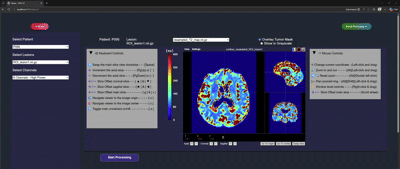
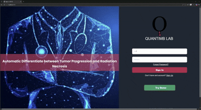
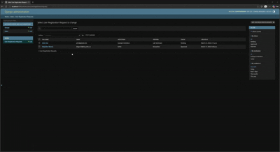

# CEST\_UI User Manual
AI-Assisted MRI-Guided Platform for Automated Differentiation Between Radiotherapy Outcomes in Patients with Brain Metastasis

#### Welcome to the CEST\_UI User Manual. This guide walks you through installing the application and using all of its features, including Demo Mode, User Mode, and account management.

  <a href="#/cest_ui-user-manual/installation" style="text-decoration:none; color:inherit; border:1px solid #e0e0e0; border-radius:8px; overflow:hidden; display:block;">
    
    
Installation Instructions

  </a>

  <a href="#/cest_ui-user-manual/demo-mode/" style="text-decoration:none; color:inherit; border:1px solid #e0e0e0; border-radius:8px; overflow:hidden; display:block;">
    
    
Demo Mode

  </a>

  <a href="#/cest_ui-user-manual/user-mode/" style="text-decoration:none; color:inherit; border:1px solid #e0e0e0; border-radius:8px; overflow:hidden; display:block;">
    
    
User Mode

  </a>

  <a href="#/cest_ui-user-manual/accounts" style="text-decoration:none; color:inherit; border:1px solid #e0e0e0; border-radius:8px; overflow:hidden; display:block;">
    
    
Accounts

  </a>

CEST\_UI is an automated artificial intelligence (AI)-guided multi-modal MRI analysis platform for distinguishing SRS treatment outcomes in patients with brain metastasis. The platform integrates and adapts a 3D Swin Transformer model (Swin-RAFT) with a modern, scalable web-based Graphical User Interface (GUI), helping radiologists as a decision support tool to differentiate between TP and RN outcomes with high accuracy, even in complex or small lesions, while focusing on their user experience

  <a href="#/cest_ui-user-manual/installation" style="display:inline-flex; align-items:center; gap:6px; font-size:13.5px; font-weight:500; color:#555; text-decoration:none; padding:8px 14px; border:1px solid #e5e5e5; border-radius:7px;">Installation →</a>

